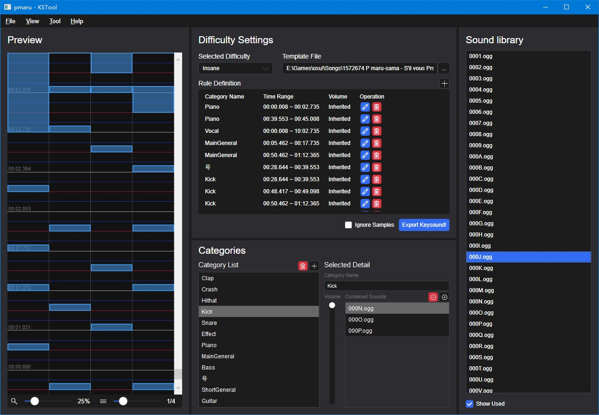

# KSTool.Om

A tool for easily adding hitsound to your beatmaps!

**WARN: Currently no auto-saving and prompting when exit. Please remember to save by yourself.**

**Basic instructions:**

- Template file: a csv file includes 3 columns: offset, filename, forceVolume(optional), which defines that when and how the hitsounds to playback.
- Sound library: hitsounds in your beatmap folder.
- Category: defines that what kind of a hitsound belongs to. (e.g. `asdf.wav` and `wow.wav` as "kicks")
- Rule definition: defines that when a category has priority to copy to an object than storyboard samples. If there is no usable objects(none of objects or all objects are hitsounded), it will copy to storyboard samples.
- Preview: preserved function, and useless at this time.
